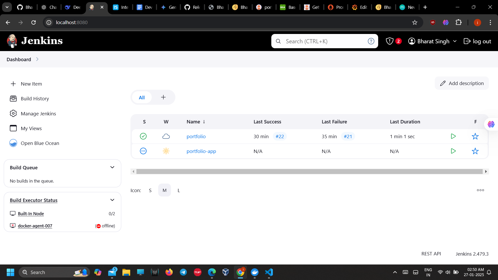
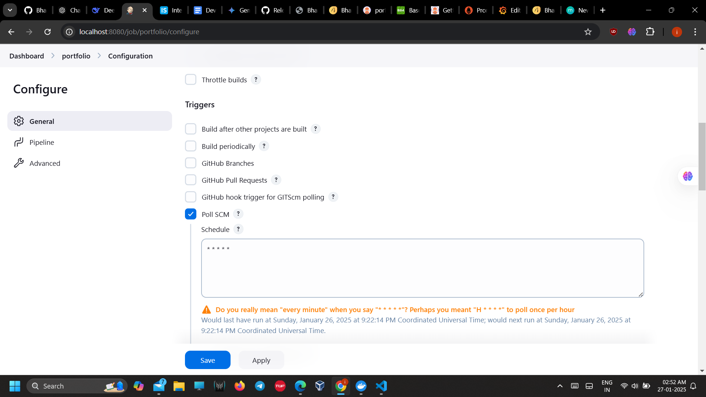
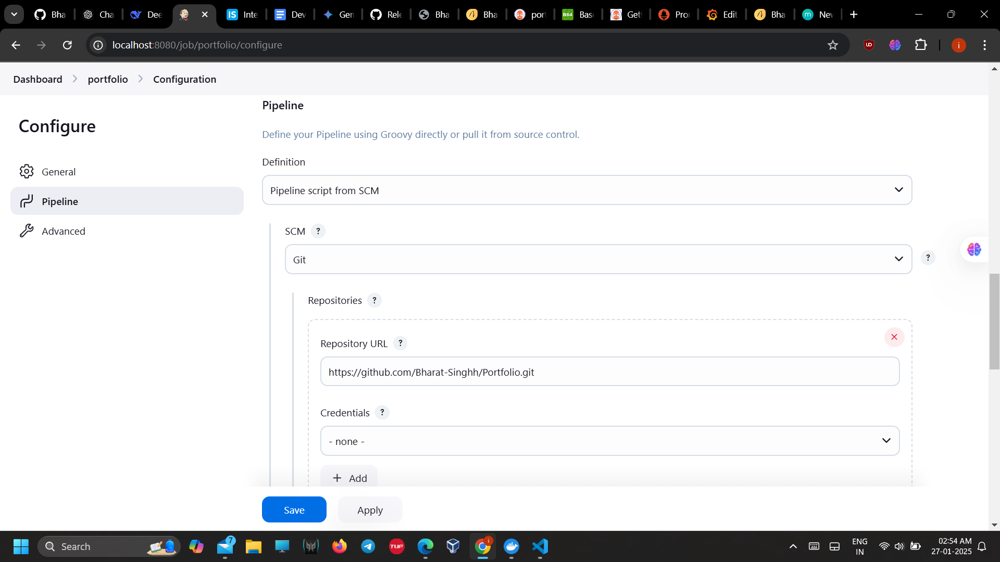
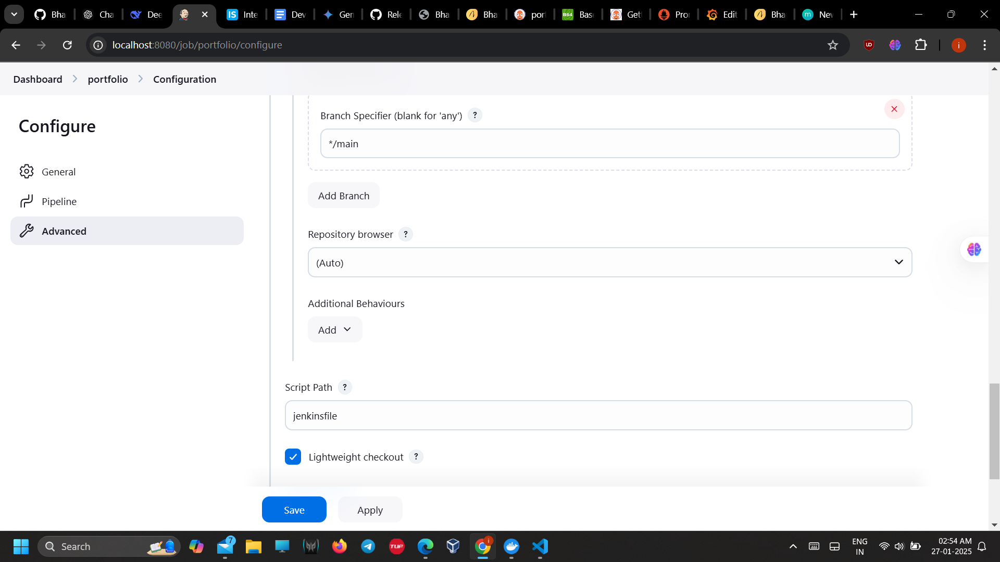
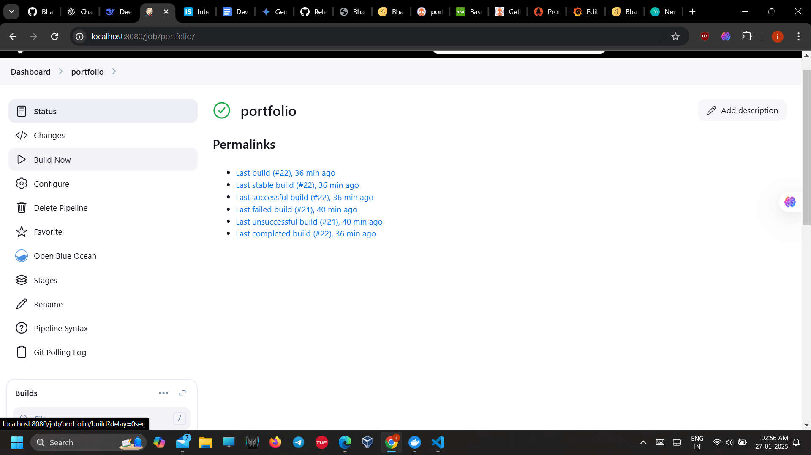
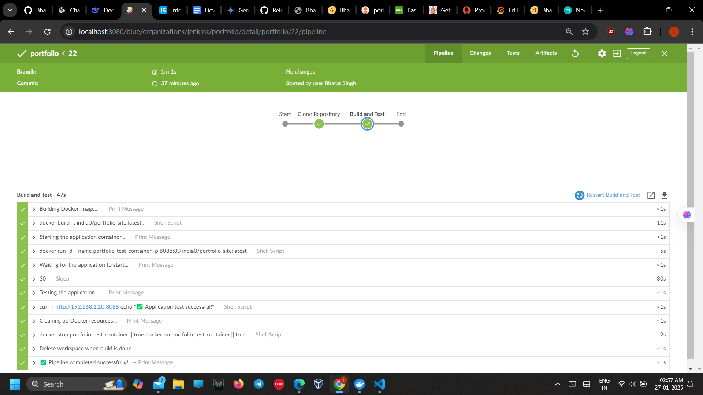
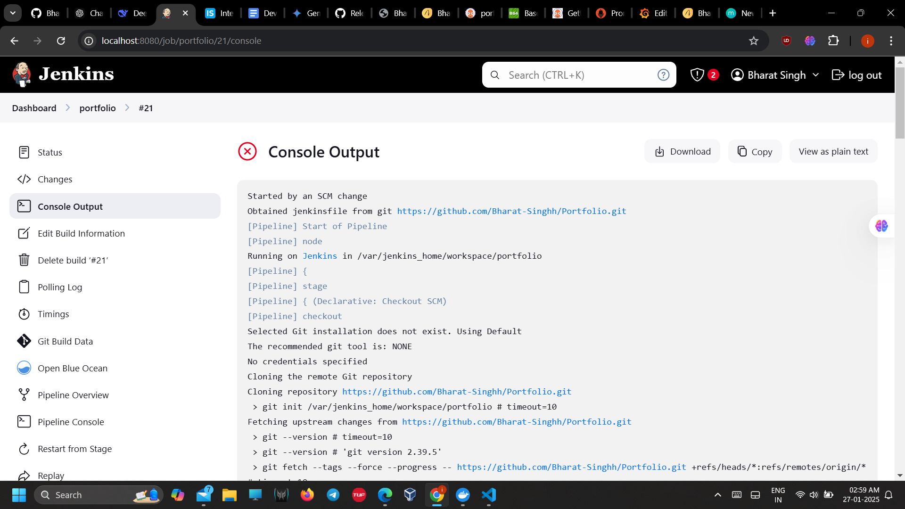
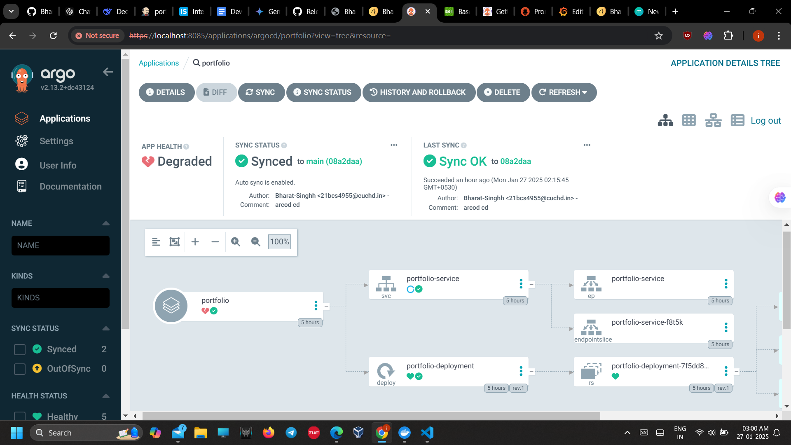
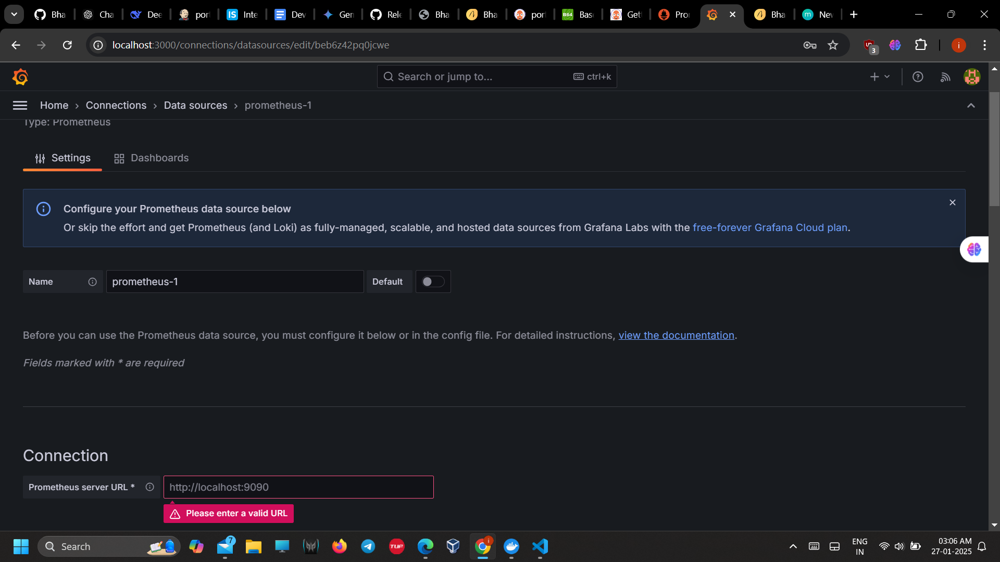

# DevOps Engineer Internship Assignment

This project demonstrates my proficiency in setting up a Continuous Integration and Deployment (CI/CD) pipeline, containerization, orchestration, and monitoring in a cloud environment. The application I worked on is my portfolio website, built using HTML, CSS, and JavaScript.

## Table of Contents
1. [Application Development and Containerization](#application-development-and-containerization)
2. [Version Control](#version-control)
3. [Continuous Integration Setup](#continuous-integration-setup)
4. [Kubernetes Deployment](#kubernetes-deployment)
5. [Continuous Deployment with Argo CD](#continuous-deployment-with-argo-cd)
6. [Canary Release Strategy with Argo Rollouts](#canary-release-strategy-with-argo-rollouts)
7. [Monitoring and Logging](#monitoring-and-logging)

## 1. Application Development and Containerization

The application developed for this project is a simple portfolio website built using HTML, CSS, and JavaScript.

### Dockerfile

The website is containerized using Docker, with the following Dockerfile:

```dockerfile
FROM nginx:alpine

# Copy HTML/CSS to the default nginx path
COPY index.html /usr/share/nginx/html/
COPY assets /usr/share/nginx/html/

EXPOSE 80

```

This Dockerfile copies the website files into the container and uses the official nginx image to serve the application on port 80.

### Build the Docker image

```bash
docker build -t india0/portfolio-site:latest .
```

### Run the container

```bash
docker run -d --name portfolio-test-container -p 8088:80 india0/portfolio-site:latest
```

## 2. Version Control

A Git repository was initialized to manage the application code. Changes were tracked and committed during the project development, showcasing the progression of the work.

### Steps for Version Control:

Initialize the Git repository:

```bash
git init
```

Add files to the repository:

```bash
git add .
```

Commit changes:

```bash
git commit -m "Initial commit - Added portfolio website code"
git commit -m "Added Dockerfile for containerization"
git commit -m "Set up Kubernetes manifests for deployment"
```

## 3. Continuous Integration Setup

Jenkins is used to set up the CI pipeline, ensuring automatic building and testing of the Docker image on code commits.

### Jenkins Setup:

- Install Jenkins inside a Docker container.
- Set up a new Jenkins job that builds the Docker image on commit.
- i make custom Jenkins docker image for this  and don't forget to download all necessary plugins in jenkins
manage jenkins-> plugins
-i used this repo to make custom docker image for jenkins https://github.com/shazChaudhry/docker-jenkins/blob/ee0f386fd1706829b956cb2e723c0f2935496933/Dockerfile

















### Jenkinsfile:

```groovy
pipeline {
    agent any

    triggers {
        pollSCM('* * * * *') // Adjust polling frequency as needed
    }

    stages {
        stage('Clone Repository') {
            steps {
                echo "Cloning the repository..."
                git branch: 'main', url: 'https://github.com/Bharat-Singhh/Portfolio.git'
            }
        }

        stage('Build and Test') {
            steps {
                echo "Building Docker image..."
                script {
                    sh 'docker build -t india0/portfolio-site:latest .'
                }

                echo "Starting the application container..."
                script {
                    sh '''
                    docker run -d --name portfolio-test-container -p 8088:80 india0/portfolio-site:latest
                    '''
                }

                echo "Waiting for the application to start..."
                sleep(30) // Increased wait time

                echo "Testing the application..."
                script {
                    try {
                        sh '''
                        curl -f http://192.168.1.10:8088

                        echo "✅ Application test successful!"
                        '''
                    } catch (Exception e) {
                        error "❌ Application test failed! Check the logs for details."
                    }
                }
            }
        }
    }

    post {
        always {
            echo "Cleaning up Docker resources..."
            sh '''
            docker stop portfolio-test-container || true
            docker rm portfolio-test-container || true
            '''
            cleanWs()
        }
        success {
            echo "✅ Pipeline completed successfully!"
        }
        failure {
            echo "❌ Pipeline failed. Check the logs for details."
        }
    }
}

```

This pipeline builds and tests the Docker image every time there is a new commit in the repository.






## 4. Kubernetes Deployment

The Dockerized application is deployed to a Kubernetes cluster using Kubernetes manifests. The following files were created:

### deployment.yaml

```yaml
apiVersion: apps/v1
kind: Deployment
metadata:
  name: portfolio-deployment
  labels:
    app: portfolio
spec:
  replicas: 3  # Adjust the number of replicas to scale your application
  selector:
    matchLabels:
      app: portfolio
  template:
    metadata:
      labels:
        app: portfolio
    spec:
      containers:
      - name: portfolio
        image: india0/portfolio-site:latest  # Replace with your Docker image
        ports:
        - containerPort: 80
        resources:
          requests:
            memory: "64Mi"
            cpu: "250m"
          limits:
            memory: "128Mi"
            cpu: "500m"

```

### service.yaml

```yaml
apiVersion: v1
kind: Service
metadata:
  name: portfolio-service
spec:
  selector:
    app: portfolio
  ports:
    - protocol: TCP
      port: 80
      targetPort: 80  # The port your container is listening on
  type: LoadBalancer  # Set to LoadBalancer or NodePort for external access

```

### To deploy:

```bash
kubectl apply -f deployment.yaml
kubectl apply -f service.yaml
```

## 5. Continuous Deployment with Argo CD

Argo CD is used to manage the deployment of the application to the Kubernetes cluster. It monitors the Git repository and automatically deploys changes when new commits are made.

### Install Argo CD on the Kubernetes cluster:

```bash
kubectl create namespace argocd
kubectl apply -n argocd -f https://raw.githubusercontent.com/argoproj/argo-cd/stable/manifests/install.yaml
```

### Configure Argo CD to monitor the Git repository and automatically deploy changes.

### Argo CD Configuration:

Create an Application in Argo CD using the following YAML:

```yaml
apiVersion: argoproj.io/v1alpha1
kind: Application
metadata:
  name: portfolio
spec:
  destination:
    name: ""
    namespace: default
  source:
    repoURL: 'https://github.com/yourusername/portfolio-repo'
    targetRevision: HEAD
    path: k8s
  project: default
```

### To apply the Argo CD application:

```bash
kubectl apply -f argo-cd-application.yaml
```


## 6. Canary Release Strategy with Argo Rollouts

Argo Rollouts is used to implement a canary deployment strategy for the application, where traffic is incrementally shifted from the old version to the new version.

### Install Argo Rollouts:

```bash
kubectl apply -f https://github.com/argoproj/argo-rollouts/releases/download/v1.8.0/rollouts-install.yaml
```

### Create a Rollout YAML file for canary deployment:

```yaml
apiVersion: argoproj.io/v1alpha1
kind: Rollout
metadata:
  name: portfolio-rollout
spec:
  replicas: 3
  selector:
    matchLabels:
      app: portfolio
  template:
    metadata:
      labels:
        app: portfolio
    spec:
      containers:
        - name: portfolio-container
          image: india0/portfolio-site:v2
          ports:
            - containerPort: 80
  strategy:
    canary:
      steps:
        - setWeight: 20
        - pause: {duration: 30s}
        - setWeight: 50
        - pause: {duration: 30s}
        - setWeight: 100
```

### Apply the Rollout:

```bash
kubectl apply -f portfolio-rollout.yaml
```

## 7. Monitoring and Logging

Prometheus and Grafana are integrated to monitor application metrics, and alerting is set up for critical metrics.
-you can download Prometheus and Grafana from this repo https://gist.github.com/piyushgarg-dev/7c4016b12301552b628bbac21a11e6ab

### Prometheus Setup:

Install Prometheus using:

```bash
kubectl apply -f https://raw.githubusercontent.com/prometheus-operator/prometheus-operator/main/bundle.yaml
```

### Configure Prometheus to scrape metrics from your application:

```yaml
scrape_configs:
  - job_name: 'portfolio'
    static_configs:
      - targets: ['<NODE_IP>:8088'] #you cant use localhost here use your ip like 192.68.x.x
```

### Grafana Setup:

- Install Grafana on your Kubernetes cluster. username and password is admin
- Set up Grafana dashboards to visualize application metrics from Prometheus.




Logging:
Centralized logging is set up using EFK Stack (Elasticsearch, Fluentd, Kibana). This helps in collecting, analyzing, and visualizing logs from the Kubernetes pods.


